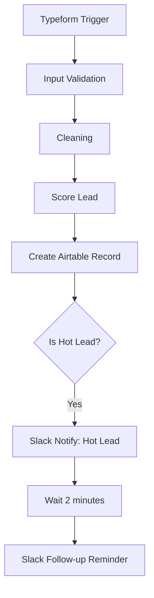

# Lead Scoring & Notification Bot

This project is an **automated lead intake and scoring workflow** built in **n8n**. It captures leads from **Typeform**, validates and cleans the data, scores the leads based on budget and interest, stores the data in **Airtable**, and sends **Slack notifications** to alert the sales team for follow-ups.

---

## ✨ Features
- Captures lead submissions from Typeform.
- Validates essential fields.
- Cleans and formats input data.
- Automatically scores leads as `Cold`, `Warm`, or `Hot`.
- Stores lead data in Airtable for tracking.
- Notifies the sales team on Slack if a lead is `Hot`.
- Sends a follow-up Slack reminder after a delay.

---

## 🔧 Workflow Overview

---

## 🧱 Lead Scoring Logic

Implemented via JavaScript node:
- **Hot:** Budget > 5000 and Interest Level is `High`
- **Warm:** Budget > 2000
- **Cold:** Everything else

---

## 📂 Airtable Schema

| Field          | Type     | Notes                          |
|----------------|----------|--------------------------------|
| full_name      | String   | Required                       |
| email          | String   | Required                       |
| phone          | String   | Optional                       |
| company_size   | String   | Optional                       |
| budget         | Number   | Required                       |
| interest_level | Options  | `Low`, `Medium`, `High`        |
| score          | Options  | `Cold`, `Warm`, `Hot`          |

---

## 📢 Slack Notifications

- **Channel:** `#sales`
- **Message:**
  - New Hot Lead: `{{$json.fields.full_name}}`, Budget: £`{{$json.fields.budget}}`, Interest: `{{$json.fields.interest_level}}`
  - Follow-up after 2 min: `Have we contacted {{$json.fields.full_name}} yet?`

---

## 🚀 Deployment Notes
- Requires valid **Slack OAuth2**, **Typeform API**, and **Airtable Token** credentials.
- Safe to import into n8n as a JSON workflow.

---

## 🔍 How to Test
1. Submit a test entry on the connected Typeform.
2. Check Airtable for record creation.
3. Observe Slack messages if the score is `Hot`.

---

## ⚡ Potential Improvements
- Add email notifications.
- Expand scoring logic with more business rules.
- Integrate CRM sync (e.g., HubSpot or Salesforce).
- Log activities in Google Sheets.

---

## 📅 Created With
- [n8n](https://n8n.io/) - Workflow Automation
- [Typeform](https://typeform.com/) - Lead Capture
- [Airtable](https://airtable.com/) - Lead Database
- [Slack](https://slack.com/) - Team Communication

---

## 👁‍🗨 Security Notice
All credential values and tokens have been removed from this exported workflow.
Ensure you configure your credentials securely before activating.

---

## 💼 License
MIT License. Feel free to reuse, extend, or modify for commercial and non-commercial use.

